# 提升用户信任度的机器学习解释框架

> 项目部署地址：[http://39.105.145.46:5001/](http://39.105.145.46:5001/)
> 
> Author：黄海文

## 系统概要

通过增强型事实检查框架对任务模型进行解释分析处理。利用偏相关方差算法、锚定算法、影响函数、反事实算法等多种算法对模型及训练集进行处理，进一步加深了对任务模型的理解。将处理结果输入到交互式机器学习模型解释可视化分析系统中，对模型进行深入分析。图 5-1 发现，任务模型本身准确率较高，达了 85.4%，损失均值约为 0.45。对于负样本的预测表现较好。

这些结果有助于我们深入理解任务模型的工作原理和预测结果，为进一步优化和改进任务模型提供了基础和借鉴。同时，使用增强型事实检查框架和交互式机器学习模型解释可视化分析系统等高级工具，为模型解释提供了新的思路和方法。

本文的创新点主要体现在运用多种算法对模型进行分析处理，从而更全面、深入地理解模型的决策规则和影响因素。我们期望本文的研究成果对机器学习领域的进一步发展和应用提供有益的启示和指导。

## 系统介绍

本系统在预测结果可视化页面中加入了交互式筛选功能，详细展示了解释模型的示例分析，帮助用户进行动态分析。该系统从全局解释和局部解释两大模块进行分析，其中局部解释又进一步分为基于归因的解释、基于示例的解释和反事实解释三个子模块。本章详细探讨了机器学习解释模型的结果分析，并提供了丰富的可视化方式，以增强用户对任务机器学习模型的信任度。

### 全局解释

左侧的菜单展示了任务机器学习模型的概要信息，包括准确率、损失率以及训练集中各预测标签的数量占比等，从宏观上为用户提供了一个初步的任务模型了解的视角。

运用偏相关方差解释方法计算得到的特征重要性权值，我们能够绘制出清晰的饼图来展示各个特征在任务机器学习模型中的重要程度占比。此外，我们还利用解释结果绘制出折线图以可视化特征值的变化程度，PDP 曲线的平坦程度反映了特征的重要性程度，越平坦表示特征不重要，PDP 曲线的变化程度越大，特征对任务机器学习模型的贡献越大。通过这些可视化手段，用户可以更加直观地了解任务机器学习模型各个特征之间的相对重要性，并深入了解各特征对模型预测结果的影响程度。

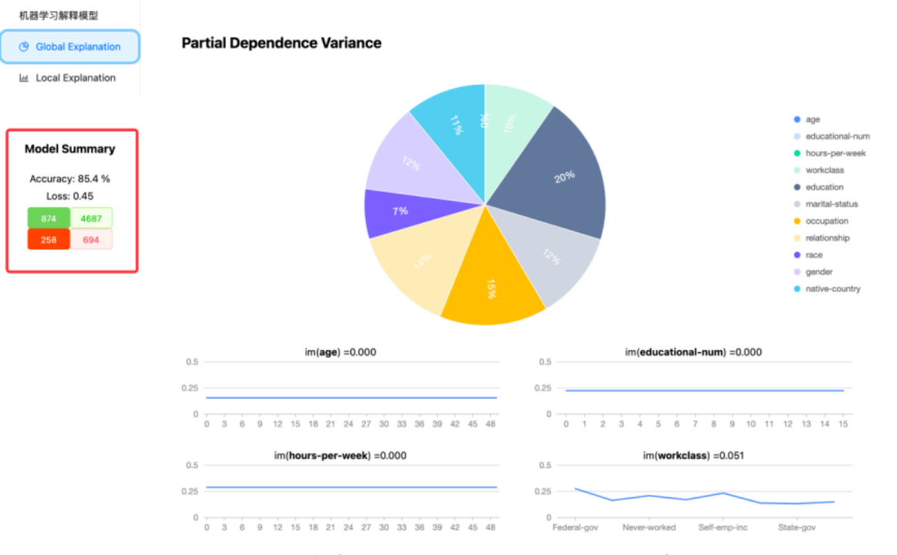

### 局部解释

为进一步分析各测试样例在任务机器学习模型下的预测结果，本研究针对各个测试点进行了详细的局部解释分析，如下图所示。局部解释分为三个子模块：基于归因的解释、基于示例的解释和反事实解释。在局部解释模块中，本研究应用了论文第三章所描述的局部解释算法，对测试点进行全面评估，并且提供了动态的用户交互功能。在这些交互功能中，用户可以对归因解释中的关键特征进行分类对比分析、对示例解释进行动态筛选、验证模型预测结果等，从而更深入地了解任务机器学习模型的预测结果和对应的解释信息。通过本研究的局部解释分析，用户可以更加直观地了解任务机器学习模型在不同测试数据上的预测结果，为用户提供更为细致全面的模型解释。

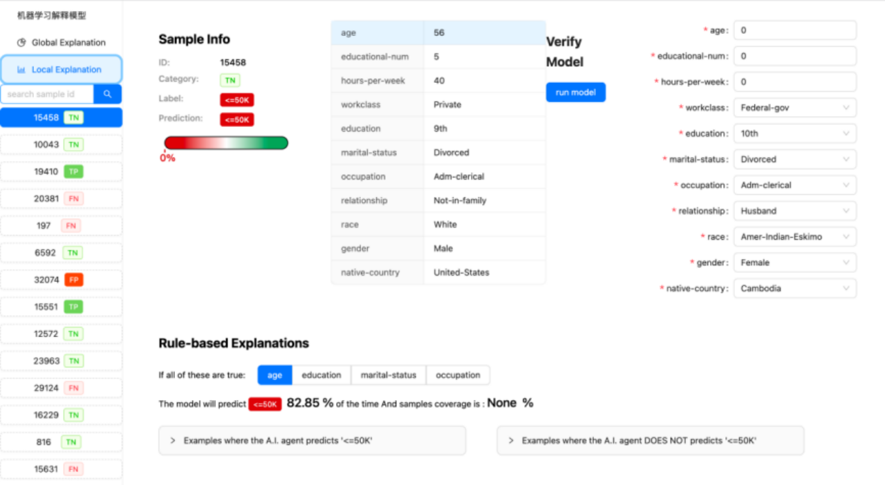

系统的左侧菜单为用户罗列了测试数据集的各个测试点，并根据任务机器学习模型的预测结果标注了各个测试点在任务模型下预测的标签，让用户可以直观地感知和选择合适的测试点进行解释分析验证。同时，该系统还提供了搜索功能，方便用户查找目标测试点 ID，以便在后续的解释分析过程中进行对比验证。

当用户选择合适的测试点进行分析后，该系统将详细展示该测试点的特征数据，并且根据该数据集的特点选中最佳的可视化方案，例如，对于离散数据集，系统选择表格形式进行可视化，对于图像数据集，则可以呈现图像示例，而对于连续数据则选用折线图表等。此外，针对具体数据集的特点，系统提供了验证模型功能，以交互式微调测试数据，以验证解释方案的准确性，从而增强用户对后续解释算法的信任度，并为存疑的解释案例提供辅助工具和可视化方案设计交互。

#### 基于归因的解释

通过基于规则的锚定算法分析计算出该测试点的关键特征。此外，锚定算法在采用 beam search 算法查找关键特征时，可罗列出在某一规则子集的约束下进行扰动的后的数据集中，预测结果与目标分析测试点预测结果一致和不一致的扰动数据点详细信息。同时，锚定算法在某一规则子集下，不仅给出了结果预测概率，还提供了该规则子集应用于采样空间的准确率和覆盖率的详细计算信息。

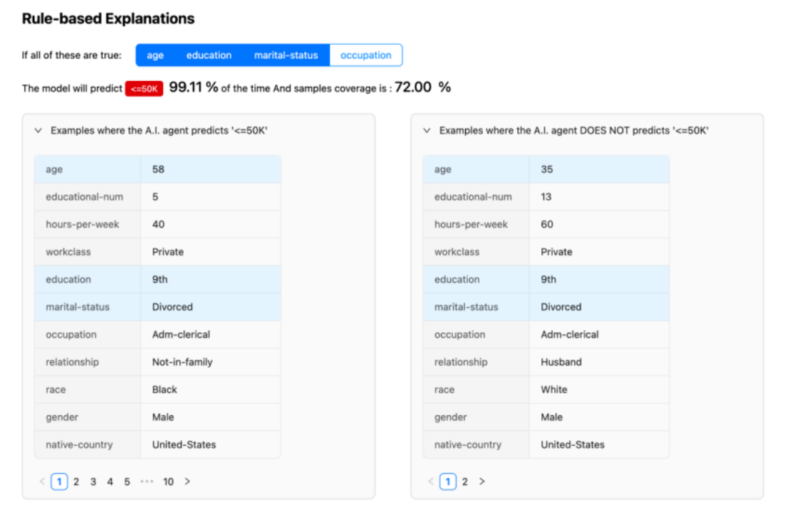

#### 基于示例的解释

在该子模块中，我们针对影响函数算法进行可视化展示，使用影响函数算法对训练集中的各个示例与该目标分析测试点之间的影响值进行计算。由于训练数据集通常非常庞大，因此我们提供了环形柱状筛选图，以支持用户进行筛选训练点的操作。这个环形柱状筛选图的设计能够帮助用户更加方便而快速地理解训练集中的各个示例的影响值。

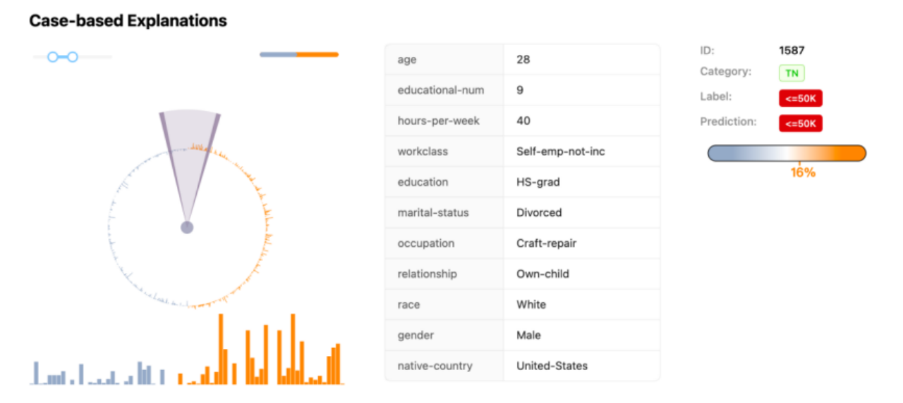

如图所示，环形柱状筛选图的左上角进度条可以将影响值在指定的区间进行筛选，以便用户选择需要分析的影响值区间。右上角则展示了有利和不利影响的训练点比例，其中，橙色表示影响值为正数的训练点，代表该训练点对目标测试点具有正面有利影响；相反，蓝色代表影响值为负数的训练点，代表该训练点对目标测试点具有负面不利影响。我们还可以利用占比条对分析结果综合分析，来得到整个训练集对任务机器学习模型在预测结果上所产生的影响导向。

在环形图可视化界面中，用户可以对选定影响值范围下的训练点数据进行整体性的分析。例如，我们可以通过该界面的筛选功能来比较测试点 a 和测试点 b，发现相比测试点 b，训练集对测试点 a 的影响值整体偏小，只有极个别训练点的影响值偏离程度较大；而对于测试点 b，训练集产生的贡献较高，正面和负面影响的训练点数均略高。由此，我们可以进一步深入理解各训练点之间的相对影响，以及它们对于任务机器学习模型预测结果的贡献。

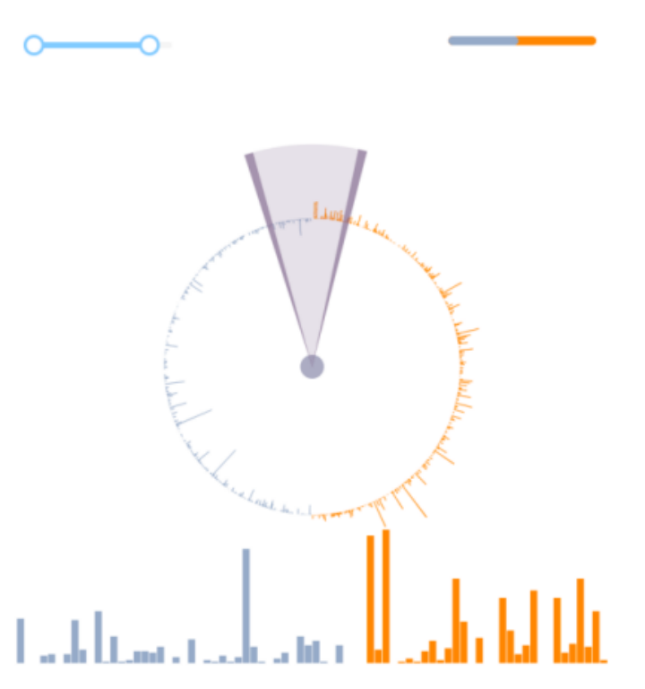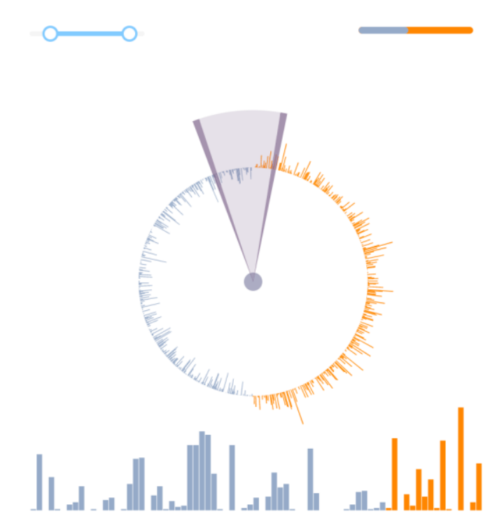

（a）                       (b)

用户可以通过拖动紫色环形筛选条，对训练点进行筛选，而筛选结果则将以柱状图的形式呈现在子模块的下方。用户只需点击某个柱状条，即可在子模块右侧显示该训练点的详细特征数据，并与目标分析测试点进行对比分析。该模块的渐变条，则能直观地显示该训练点对测试点的影响程度。

除此之外，我们还提供了平行坐标图。图 4-8 显示对测试示例影响最大的前 10 个训练样本，其中包括有利和不利影响各 10 个。测试用例通过红色数据进行特别注释，我们可以看到，数据越宽，透明度越低，则说明某一训练实例对于测试示例的影响程度越大。用户可以通过鼠标悬停在平行坐标图上，显示具体的数值。当用户点击某个训练点时，该模块则将展示该训练点的详细数据情况。通过该平行坐标图，用户可以更直观地展示相似的数据共性和对于目标分析测试点的影响程度，从而更好地进行对比分析。

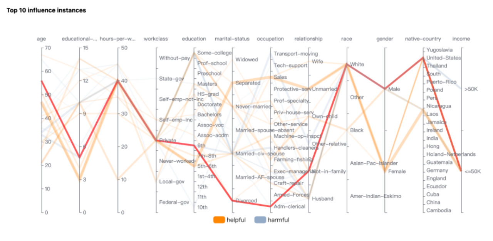

#### 反事实解释

由于我们在实验中选择的数据集以表格的形式呈现，因此反事实算法生成的建议也是以表格化的方式展示。表格的首行显示了当前分析的测试点数据，依次排列了反事实算法生成的 5 个相似的反转示例。通过微调这些示例的模型特征数据，任务机器学习模型将得到不同的预测结果，从而使得用户可以进一步分析和理解任务模型。

同时，对于一些例如贷款预测、医疗补助发放等案例，该子模块还可以为决策者提供反事实建议，以帮助他们进行下一步的改进计划。

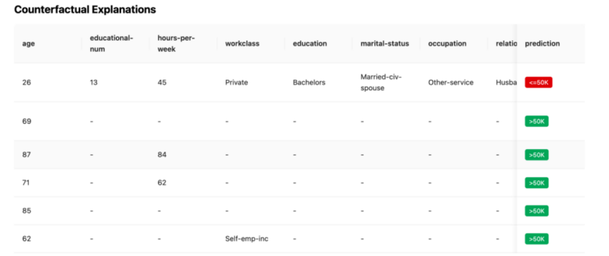

## 案例分析

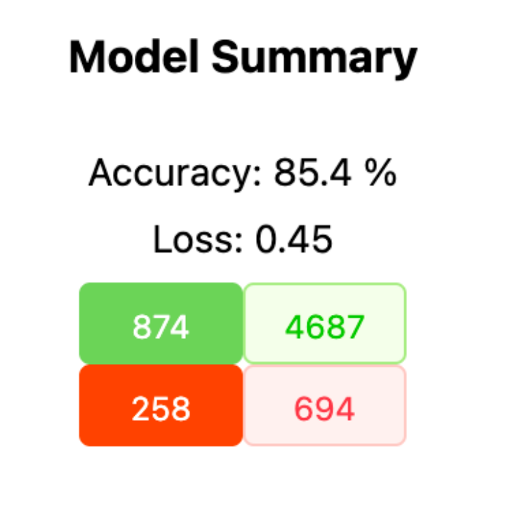

#### （1）全局解释

由特征偏相关方差的饼图分析可知，各特征的重要性占比相对均衡。值得注意的是，基于用户的受教育水平信息，education 成为最重要的特征，其次是 occupation。同时，在观察到的数据中，连续特征的重要性相对较低。

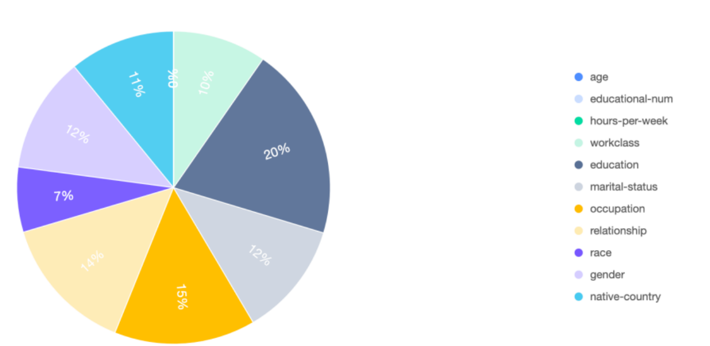

通过各特征的 PD 图分析可知，education 特征的权重最大，达到了 0.105。具体而言，在 education 特征值为 Doctorate 时，收入预测大于 50k 的概率较高；而在 education 特征值为 10th 时，收入预测小于等于 50k 的概率较高。类似的，occupation 特征的权重次之，相关的预测概率特征值分布也呈现出相应的不同特征值分类概率。PD 折线图进一步展示了各特征值的分类概率，提供了更加详细的信息展示。

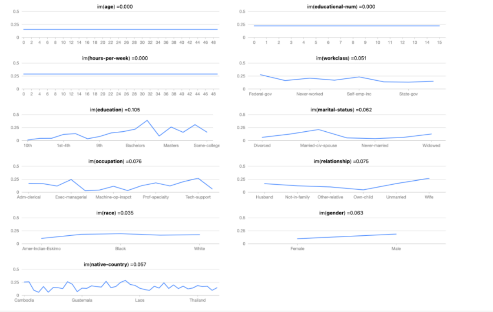

全局解释有助于用户了解任务模型的基本情况。通过局部解释进一步论证各特征的重要性。选择任一测试用例，以id=15458测试用例为例，预测该用户年收入>50k的概率为0%，即任务模型预测认为该用户很大可能年收入<=50k，用户针对这一结果进行最终决策，判断该用户最终结果。针对这一预测结果，增强型事实检查框架将通过三大模块进行详细分析，进一步提高用户对于最终决策的信任程度。这种解释方式不仅可以提高用户对于预测结果的接受度，也为优化模型设计提供了指导意见。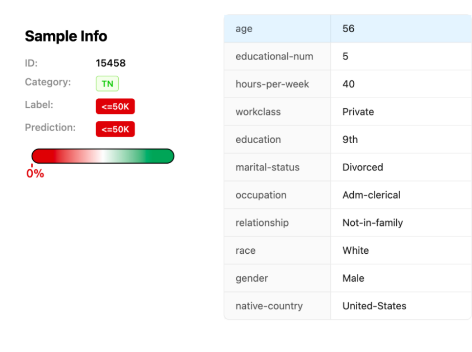

#### （2）基于归因的解释

通过 Anchor 算法计算，可得到针对 id=15458 测试用例的四个关键性特征分别为 age、education、marital-status、occupation。进一步分析表明（如 a 图），当 age 与用例相似且 educational-level 为 9th 时，任务模型将有 91.91%的概率预测结果为<=50k，同时满足以上两个规则的覆盖率为 83%。当满足了四个规则时（如 b 图），任务模型的预测准确率可提升至 99.11%，但与此同时，满足所有四个规则的样本比例将降低至 71%。在计算过程中，系统描述了所修改的数据样例，图示表明随着满足规则的数量增加，样本存在的概率也将相应降低。

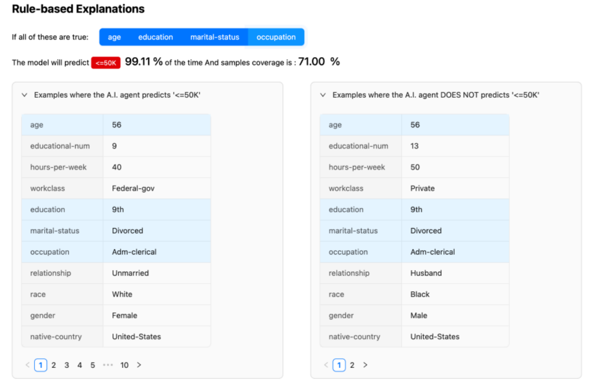

（a）

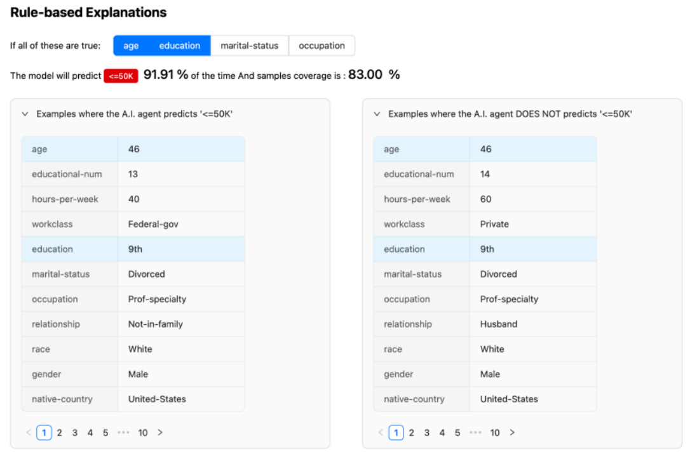

(b)

基于归因算法计算得出的关键特征结果与全局解释中 education、occupation 重要性较高的结论相吻合，证实了这些特征对于任务模型的决策具有重要影响。同时回到全局解释可发现，当 educational-level 为 9th 时，预测结果更偏向于收入<=50k，在 occupation 为 Adm-clerical 时，预测结果同样更偏向于收入<=50k。这进一步验证了前文对于全局解释结果的解读，有助于用户更好地理解任务模型决策背后的规律和原因。

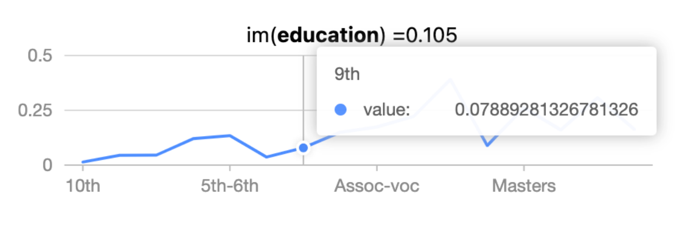

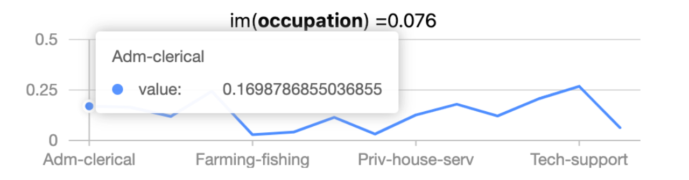

#### （3）基于示例的解释

根据影响函数算法的计算结果，通过环形柱状筛选图可得出各训练示例对于 id=15458 测试用例的影响程度。显示为橙色所示训练点对该测试用例产生正面影响，而蓝色则表示反之；右上角进度比例条可用于得出训练集整体对该测试用例产生正面影响的训练点占比相对较大，但整体影响水平较低，仅极少数训练点的影响特殊。因此，通过观察平行坐标图对比分析 top10 最相似和最不相似的训练用例，有助于深入了解测试用例在训练集中的特殊情况和模型建模过程的差异化。

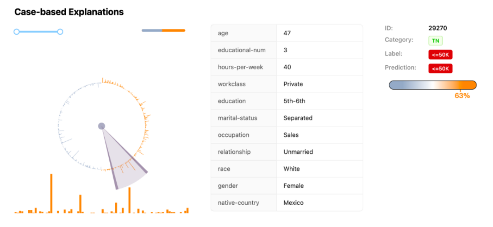

针对平行坐标图进行筛选，选取对测试用例产生正面影响最大的训练用例（本例选取 id=29270 训练用例），并对比分析二者的关系。图 5-8 显示，两个用例的年龄、教育程度和每周工作时长等连续性特征处于相似水平，而其余特征均为离散性特征，不能通过观察趋势得出直观结论，需要结合数据集的上下文信息进行逐个判断。例如，两个用例均为白人且来自发达国家，教育程度不高，婚姻状态都处于离异或分居，关系状态为未婚或非家庭成员，因此可推断两个用例均为单身且无共同经济来源，职业收入相似。由此，可以得出结论，任务模型所预测的结果与该训练用例具有很高的相似性。同样的，可以对比分析其他训练用例以进一步验证此结论。

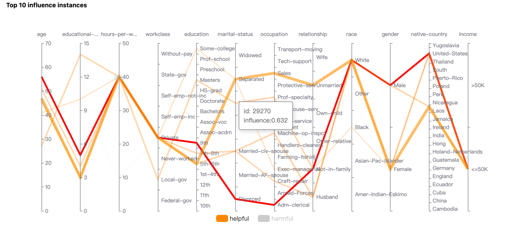

对于平行坐标图的筛选，选取了对测试用例产生负面影响最大的训练用例（本例选取 id=9173 训练用例），并对比分析二者关系。图表明，两个用例的年龄和受教育时间等连续特征存在差异，9173 训练用例相较目标测试用例更年轻且文化水平较高。在婚姻状况和社会关系上，该训练用例为已婚男性，与目标测试用例的用户画像相似度较低。虽然在最终的真实标签上，该训练用例的收入>50k，但任务模型预测结果却为<=50k，对预测结果产生了较大的负面干扰。

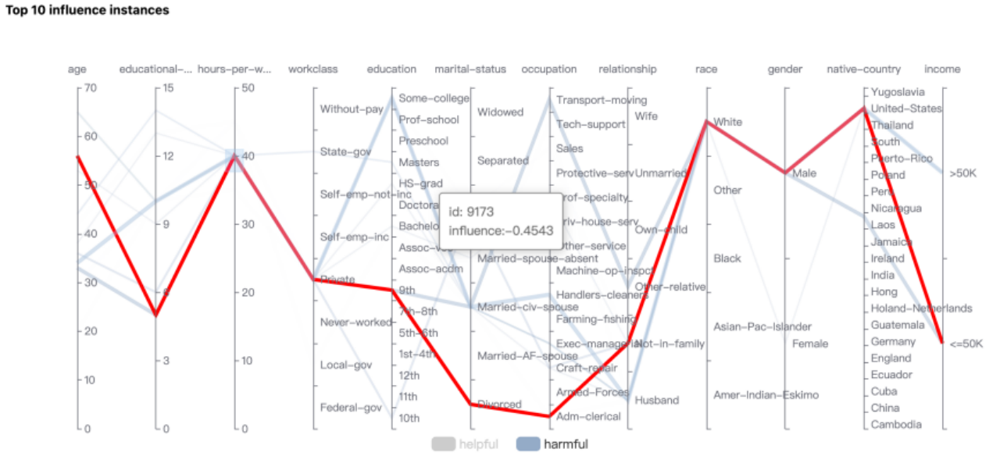

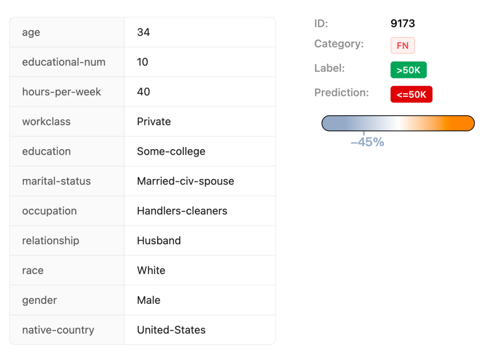

#### （4）反事实建议

以上分析针对预测结果进行了论证，旨在提高用户对于预测结果的信任度。为了让用户更好地理解预测结果的含义，系统基于反事实解释算法计算并生成了反转预测结果的可采用特征调整方案。算法生成的建议方案主要集中在修改关键性特征，如提高用户学历、改变婚姻状况和社会关系等。这些建议准确地符合了上文所述的特征重要性分析结论，因此用户对这些解释的信任度将大大提高。

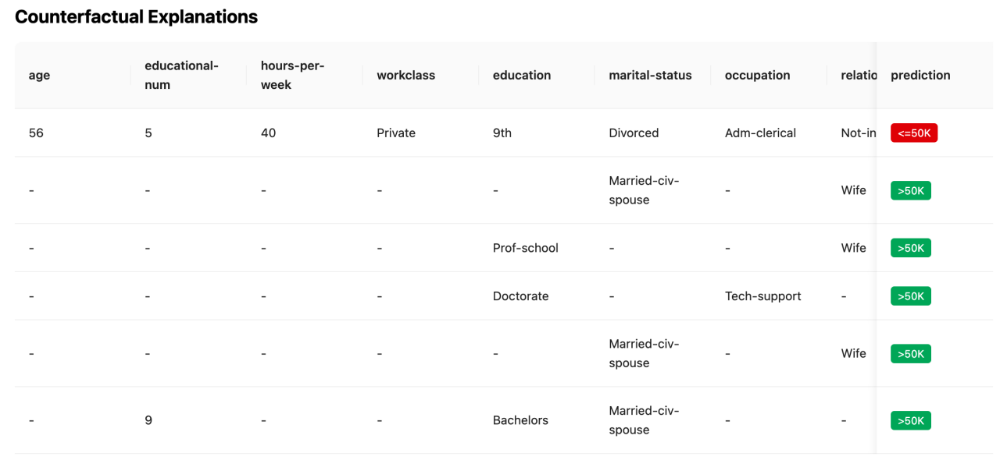
